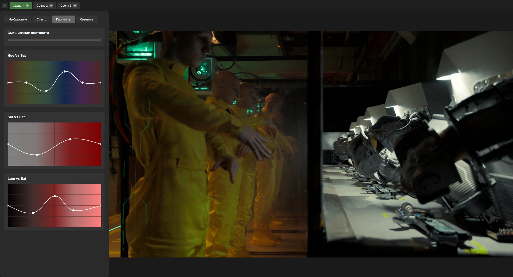
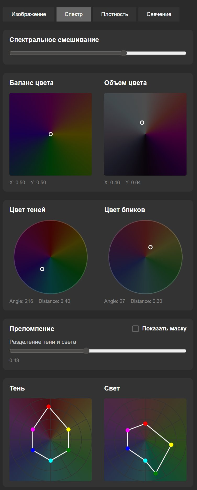
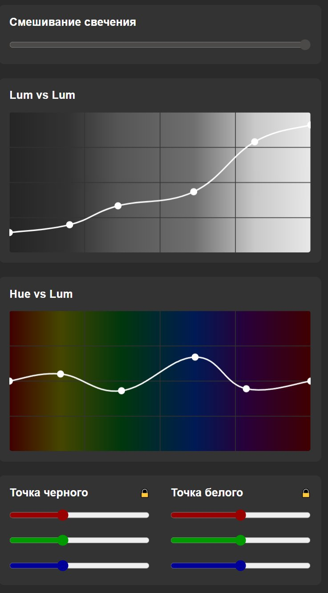

# MyColor

Real-time film emulation engine in a single GLSL shader. Runs in the browser via WebGL 2.0.

The entire color pipeline — spectral refraction, dye density simulation, light scatter, ACES tone mapping — executes per-pixel on the GPU. No precomputed lookup tables for the grading itself, only for camera IDT/ODT transforms.



## Film emulation model

The shader (`assets/shader.glsl`, 1800 lines) implements three optical processes that happen in real film:

### Spectral refraction

Light passing through film emulsion refracts differently depending on wavelength. The shader decomposes the signal into 6 chromatic channels (R-Y-G-C-B-M) and applies independent hue rotation and saturation per channel, weighted by a luminance-dependent separation mask:

```glsl
vec3 refrakt(vec3 rgb, vec4 pR, vec4 pY, vec4 pG, vec4 pC, vec4 pB, vec4 pM, float lum, float spr)
```

Each channel pair is interpolated based on which RGB component dominates (6 cases covering the full hue wheel). The separation mask (`makeRefractionMask`) controls how deeply the refraction penetrates into shadows vs highlights — emulating how thicker emulsion layers refract more.

The UI exposes this as two circular pickers (shadow/highlight color) with independent spline curves for shadow and highlight refraction response.

<p align="center">

</p>

### Dye density (saturation model)

Film dye density is not linear saturation. The `dns()` function models how dye concentration affects color:

- Below 0.5: desaturation toward luminance (thin dye layer)
- Above 0.5: nonlinear density increase with highlight rolloff (`hlko`) and chromatic compression (`crmko`)
- Density boost is bounded by `maxComponent / max(result)` to prevent channel clipping

Three spline curves (Hue vs Sat, Sat vs Sat, Lum vs Sat) control density independently across the hue wheel, saturation range, and luminance range.

### Light scatter

The `skatter()` function simulates how light scatters through emulsion, tinting shadows and highlights differently:

- **Shadow scatter**: luminance-weighted with hue proximity fallback — scatter intensity peaks in midtones and falls off via `exp(-5.5 * lum)`, with a hue-distance mask that reduces scatter for colors far from the target hue
- **Highlight scatter**: applied as multiplicative tint with `exp(-2.2 * lum⁴)` rolloff
- **Luminance preservation**: final luminance is corrected in YIQ space to prevent scatter from shifting overall brightness

<p align="center">

</p>

### Luminosity

Lum vs Lum and Hue vs Lum curves operate in YIQ color space. The `lch_mod()` function remaps luminance while preserving chrominance ratio through an inverse soft-step transfer function. Black and white points are applied per-channel with separate shadow/highlight influence curves.

## Color science

- **60+ camera IDTs**: ARRI LogC/LogC4, Sony S-Log/S-Log2/S-Log3, Canon Log/Log2/Log3, RED Log3G10, BMD Film (all models), Panasonic V-Log, DJI D-Log, Fuji F-Log, GoPro, Nikon, Z CAM, Leica, Apple Log, ACES 2065-1/cc/cct/cg, DaVinci Wide Gamut
- **24 output ODTs**: sRGB, Rec.709, Rec.2020, HDR ST.2084, P3 variants, ACES, DaVinci WG, ARRI, Kodak 2383 emulation
- Full **ACES RRT** (Reference Rendering Transform) with segmented spline tone mapping (c5/c9) implemented in GLSL
- IDT/ODT via 64³ 3D LUT textures, grading math is purely analytic

## Export

- **3D LUT** (.cube) — bakes the entire pipeline into a standard 3D lookup table for any grading software
- **DCTL** (`mycolor.dctl`) — DaVinci Resolve plugin with matching parameters, same math ported to DCTL syntax

## Running

```bash
python -m http.server 8000
# open http://localhost:8000
```

Or `start.bat` on Windows.

## Structure

```
assets/shader.glsl      — the film emulation shader (1800 lines GLSL)
src/main.js             — WebGL setup, uniform binding, render loop
src/SplineEditor.js     — interactive curve editor (cubic spline interpolation)
src/Picker2D.js         — 2D/circular color pickers
src/colorSpaces.js      — IDT/ODT color space definitions
src/exportLUT.js        — 3D LUT generation and .cube export
src/SceneManager.js     — preset management
mycolor.dctl            — DaVinci Resolve DCTL port
assets/luts/            — 64³ 3D LUT data (JSON)
```

No build step, no dependencies. Pure HTML/JS/GLSL, ~5800 lines total.
